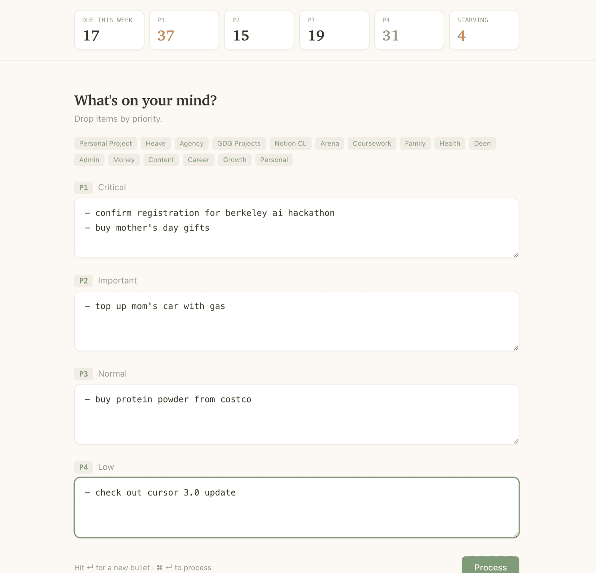
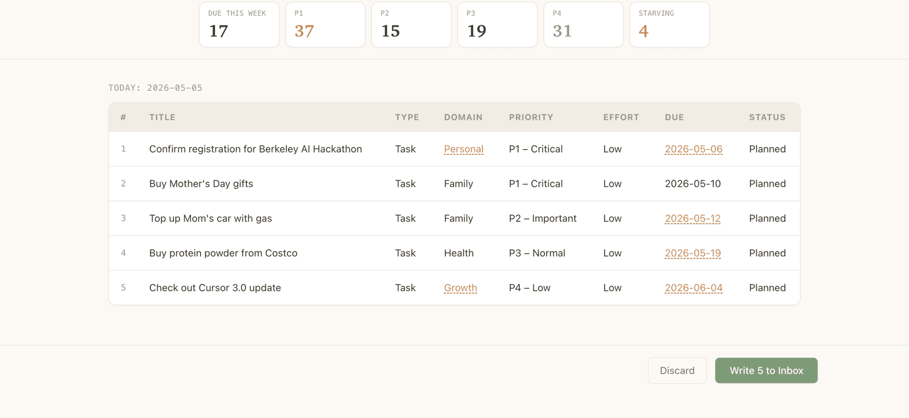
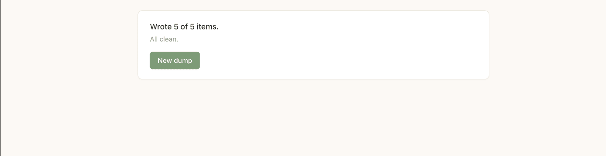

# dumpr

Type a brain dump → Claude parses it into Notion rows → review/edit → write.







Built on the Claude Agent SDK. Uses your Claude Code OAuth, so there's no API
bill — inference runs on your Max subscription.

## Why

<!-- TODO(ady): write 3-5 sentences in your own voice. The personal-problem
hook from the X-post: capturing P1/P2/P3 brain dumps fast, the metadata
typing is the bottleneck, dumpr removes it. -->

## Setup

### 1. Notion database

Create a database with these 7 properties — exact names, case-sensitive:

| Property         | Type     | Options                                                          |
|------------------|----------|------------------------------------------------------------------|
| `Title`          | Title    | —                                                                |
| `Type`           | Select   | `Task`, `Project`                                                |
| `Domain`         | Select   | (you choose — see step 3)                                        |
| `Priority Level` | Select   | `P1 – Critical`, `P2 – Important`, `P3 – Normal`, `P4 – Low` ⚠   |
| `Effort`         | Select   | `Low`, `Medium`, `High`                                          |
| `Status`         | Select   | `Backlog`, `Planned`, `In Progress`, `Blocked`, `Done`, `Dropped`|
| `Due Date`       | Date     | —                                                                |

⚠ **Priority values use an em-dash (`–`), not a hyphen (`-`).** Copy-paste
the exact strings from the table above. Notion select options match exactly,
so a hyphen will silently fail with a write error like
`Priority "P1 - Critical" is not a valid option`.

### 2. Notion integration

1. Create an internal integration at <https://www.notion.so/profile/integrations>
   with capability **Insert content**.
2. Open your database → **…** menu → **Connections** → grant your integration
   access.
3. Copy the integration token (`secret_…`).
4. Find your **data source ID** (this is what the v5 SDK writes to — *not*
   the database ID). Open the database as a full page, then **…** menu →
   **Copy link to data source**, and pull the UUID from the copied URL.

### 3. Customize your domains (the personal axis)

Domains are the life-buckets that mean something to **you**. The repo ships
with the author's 16 domains (`Heave`, `GDG Projects`, `Coursework`, …) as
a working example — they will not match your life. Edit three places:

1. **`lib/types.ts`** — `DOMAIN_VALUES` array (the canonical list).
2. **`lib/notion.ts`** — `DOMAIN_ICONS` map (one emoji per domain;
   sets the per-page icon in Notion).
3. **`skills/SKILL.md`** — the "Domain inference" section near the bottom.
   This is what the AI uses to decide which domain a dump line belongs to.
   The most important of the three.

For each domain you set, also add it as a select option on the `Domain`
property in your Notion database, otherwise writes will fail.

### 4. Environment

Copy `.env.local.example` → `.env.local` and fill in your values:

```
NOTION_TOKEN=secret_<your token>
NOTION_DATA_SOURCE_ID=<your data source UUID>
```

### 5. Claude Code OAuth

This app uses your Claude Code OAuth — there's no `ANTHROPIC_API_KEY`,
inference runs on your Max subscription. If you don't already use Claude
Code:

```bash
npm install -g @anthropic-ai/claude-code
claude /login
```

This creates `~/.claude/config`, which the agent SDK reads automatically.

### 6. Run

```bash
npm install
npm run build
npm run start
```

Open <http://localhost:3000> and bookmark it. For development:
`npm run dev`.

## How it works

`lib/skill.ts` reads `skills/SKILL.md`, appends a JSON-output override, and
sends both as a system prompt to Claude via `@anthropic-ai/claude-agent-sdk`.
The model returns a JSON array of typed items. Zod validates the shape, the
UI shows a preview table for inline editing, and on confirm the rows are
written to Notion sequentially via `@notionhq/client`. See
`docs/superpowers/specs/2026-05-04-brain-dump-gui-design.md` for the full
design.

## Tests

```bash
npm test
```

34 tests covering SKILL.md prompt assembly, Item → Notion property mapping,
batch writes with stop-on-first-failure, agent-SDK orchestration with JSON
validation, and both API routes. All tests mock the agent SDK and Notion
client — no live services touched.

## License

MIT. See `LICENSE`.
